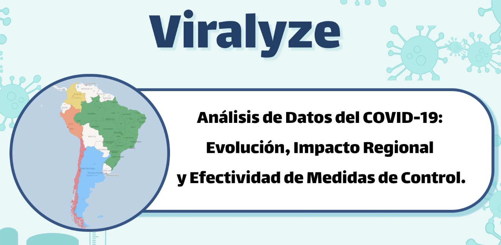
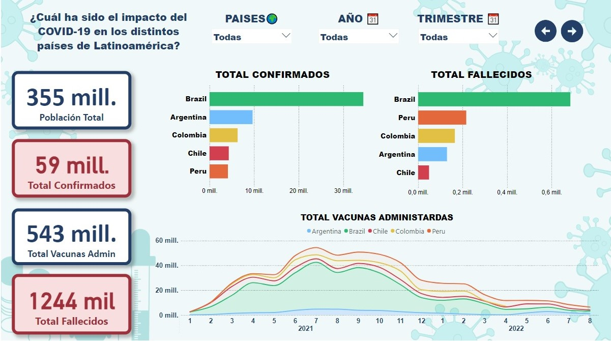
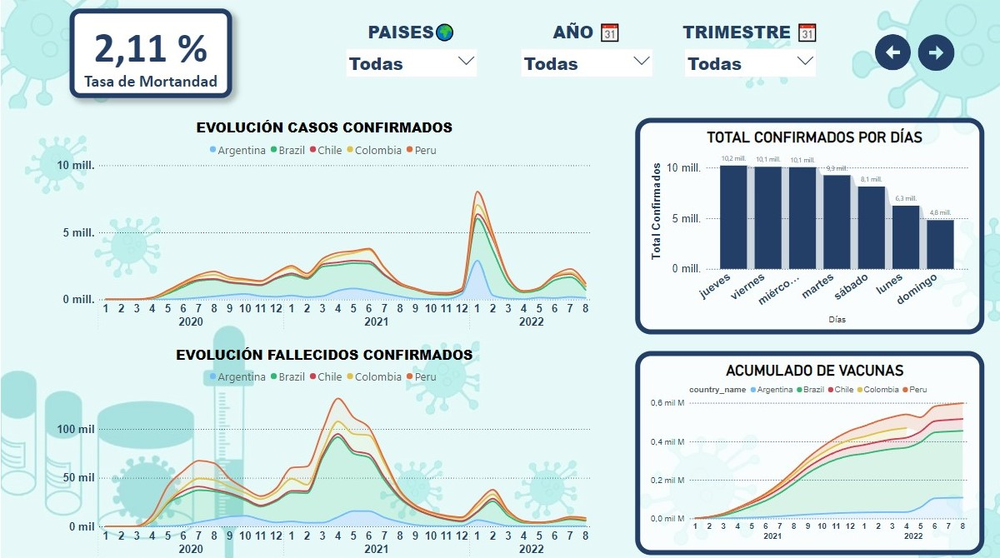
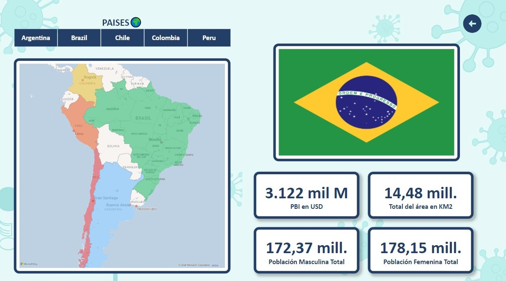

# <h1 align="center">_Viralyze_</h1>

  

## Índice

1. [Descripción](#descripción)
2. [Características](#características)
3. [Requisitos](#requisitos)
4. [Instalación](#instalación)
5. [Estructura del Proyecto](#estructura-del-proyecto)
6. [Enlaces](#enlaces)
7. [Reportes - Power BI](#reportes---power-bi)
8. [Colaboradores](#colaboradores)
9. [Tecnologías](#tecnologías)

## Descripción

Este proyecto tiene como objetivo analizar los datos del COVID-19 para proporcionar insights sobre la evolución de la pandemia, el impacto en diferentes regiones y la efectividad de las medidas de control. Utiliza técnicas de análisis de datos y visualización para interpretar y comunicar los resultados.

## Características

- Análisis temporal de casos confirmados y fallecimientos.
- Visualización de tendencias acumulativas.
- Seguimiento de dosis de vacunas administradas.
- Comparación entre diferentes regiones.
- Predicciones y modelado de datos.

## Requisitos

- Python 3.x
- pandas
- matplotlib
- seaborn
- numpy
- jupyter 

## Instalación

1. Clona este repositorio:
   git clone https://github.com/No-Country-simulation/s16-21-n-data-bi

## Estructura del Proyecto

- Viralyze/
- │
- ├── data/                    # Directorio para los datos procesados
- ├── images/                  # Imagenes del readme
- ├── Notebooks/               # Jupyter Notebooks para análisis exploratorio y Machine Learning
- ├── .gitignore               # configuracion de archivos ignorados
- ├── app.py                   # Archivo de aplicación del deploy en Streamlit
- ├── README.md                # Este archivo README
- ├── requirements.txt         # Archivo de requisitos
- └── ...

## Enlaces

Deploy: https://viralyze.streamlit.app/

Dashboard: https://bit.ly/Viralyze

## Reportes - Power BI

  
  
  

## Colaboradores

|                         | Nombre   |   Rol                    | GitHub & LinkedIn                                                                                                                                                                                          |
| ----------------------------- | -------- | ---------------------- | ------------------------------------------------------------------------------------------------------------------------------------------------------------------------------------------------------- |
|  | Angel Jaramillo Sulca | Data Engineer  |                           |
|                               |
|  | Carolina Romero | Machine Learning |                           |
|                               |
|  | Fabricio Diego Angulo Luna | Data Engineer |                           |
|                               |
|  | Fabrizio Flamini | Analista de Datos |                           |
|                               |
|  | Gabriel Valdez | Analista de Datos |                           |
|                               |
|  | Gonzalo Raffo | Data Engineer |                           |
|                               |
|  | Marcelo Ortiz | Machine Learning |                           |
|                               |
|  | Yesica Milagros Leon | Analista de Datos |                           |
|                               |
|  | Fernando Vergel | Team Leader |                           |
|                               |

## Tecnologías

